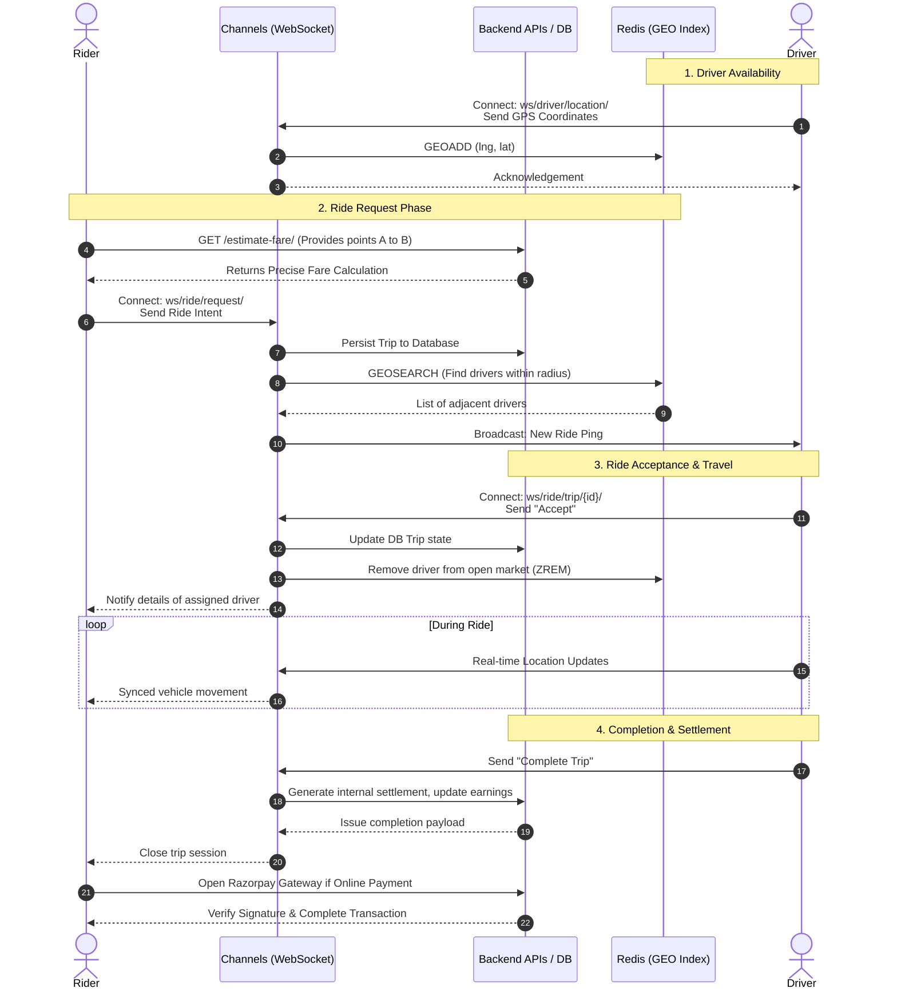

# VahanGo Backend - Comprehensive Overview

VahanGo is a robust, dynamic, and driver-first urban mobility ride-hailing platform. Built on modern backend architectures, the project supports real-time WebSocket communication, geospatial data handling, API-driven core business logic, and payment processing.

This document serves as a high-level technical analysis, detailing what has been implemented, how the system works, the underlying workflows, and the current state of the project mapped against MVP requirements.

---

## 1. What Has Been Implemented

A large portion of the robust foundation necessary for a highly concurrent ride-hailing backend is already fully functional.

### **Core Modules & APIs**
- **Authentication (`auth_user`)**: Phone-number-based login via OTP, coupled with secure JWT (SimpleJWT) access and refresh tokens. Supports multi-role models (Rider, Driver, Admin).
- **Rider Experience (`rider`)**: Profile management, favorite locations, real-time nearby driver fetching, in-app notifications, and complete ride history endpoints.
- **Driver Management (`driver`)**: Comprehensive driver profiles, vehicle registration CRUD, location polling, and earnings dashboards.
- **Admin Dashboard APIs (`/driver/admin/`)**: Complete administrative control to list drivers, review profiles, approve/reject KYC verifications, and remove drivers directly from the platform.
- **Ride Lifecycle (`ride`)**: Fare estimation engine (integrates distance, duration, and time-based surge), dynamic ride requests, and full lifecycle tracking (Requested &rarr; Accepted &rarr; In Progress &rarr; Completed/Cancelled). Rating and review mechanics are strictly integrated.
- **Payment Processing (`payments`)**: Razorpay gateway integration for online payments. Includes dynamic handling of cash vs. online scenarios, signature verifications, and automated webhook completion.

### **Real-Time Systems & Concurrency**
- **Django Channels / WebSockets**: Dedicated consumers handle continuous bi-directional flow:
  - `DriverLocationConsumer`: Streams GPS locational data every few seconds.
  - `RideRequestConsumer`: Facilitates instant matchmaking algorithms and pushes pings to active drivers.
  - `TripStatusConsumer`: Broadcasts synchronous state updates to both ends, tracking a trip reliably from start to end.
- **Redis Integration**:
  - **GEO Indexing (`GEOADD`, `GEOSEARCH`)**: Instantaneous matching of riders with available drivers within customizable geometric radii.
  - **Redis Streams**: Scalable event logging (e.g., active GPS polling footprints vs ride requests).

---

## 2. How It Works (The Core Workflow)

At its heart, VahanGo operates utilizing real-time bidirectional syncing and rapid geographic indexing.
1. **Connectivity**: Drivers connect to the system via WebSockets. Their current location is polled continuously and indexed in **Redis GEO**.
2. **Request Processing**: When a Rider needs a ride, the system instantly computes Fare Estimates (base + distance + duration + surges). The Rider initiates a Ride Request.
3. **Matchmaking Engine**: The backend queries Redis (`GEOSEARCH`) for all active drivers within a certain radius. It then multicasts a ride ping via WebSocket to the relevant drivers and simultaneously pushes FCM notifications.
4. **Acceptance & Execution**: The designated Driver accepts. The Driver is removed from the "available" GEO pool. A shared WebSocket group tracks the real-time trip state updates until completion.
5. **Settlement**: Upon ending a ride, the `payments` application creates an invoice, splits commissions, and interfaces with the Razorpay API if the customer opts for a digital transaction.

### Workflow & Architecture Diagram



---

## 3. Scope & MVP Progress Analysis

Comparing the implemented stack against the core logic delineated in the **SaaradhiGo PRD**:

### **Overall Completion: ~88%**

```text
███████████████████████████░░░  88% Complete
```

The system possesses a scalable foundation. Features that remain represent secondary integrations rather than core infrastructure barriers.

### **Implementation Breakdown Status**

| Category | MVP Features | State | Completion % |
| :--- | :--- | :--- | :---: |
| **Foundation** | Auth (OTP, JWT), Profiles, Vehicles | **Done** | 100% |
| **Real-Time** | Sockets, Driver Tracking, Geo Matchmaking | **Done** | 100% |
| **Rides** | Creation, Lifecycle, Ratings, History | **Done** | 100% |
| **Financials** | Fare Estimation, Settings, Earnings, Razorpay | **Done** | 100% |
| **Admin APIs** | KYC Approvals, Driver Verification & Deletion | **Almost Done** | 90% |
| **Push Alerts** | Notifications / Broadcasters | **Partial** | 90% |
| **Dynamic Surge** | Complex Supply/Demand modifiers | **Partial** | 80% |
| **Help/Support** | Ticketing REST endpoints | **Started** | 15% |
| **ETA** | Machine Learning / Map APIs Routing Time | **Pending** | 0% |
| **DevOps** | CI/CD, SSL, Hardened Production Server | **Partial** | 50% |

---

## 4. Remaining Work State & Next Steps

The next steps for the engineering focus solely on concluding auxiliary services required to be perfectly robust for public release. 

### What needs an immediate focus?
1. **ETA Calculations Engine (Pending - High Priority)**: Currently, time estimations rely on naive validations. Implementing the Google Maps Directions API or open-source equivalents to actively generate true pickup and drop-off ETAs.
2. **Support Ticket APIs (Low Overhead - Medium Priority)**: The schema `SupportTicket` exists within `servers/support/models.py`. Standard Django REST framework views (List, Create, Patch) need to be fleshed out to attach in-app help flows.
3. **Advanced Admin APIs Extension (Medium Priority)**: Existing endpoints cover Driver verification exceptionally well. The Admin views need to be broadened to cover Ride resolution disputes, Rider supervision, and broad financial analytics reports (GBV).
4. **Dynamic Contextual Surge Pricing (Medium Priority)**: Current surge heavily depends on time (e.g. night surge). Modifying `--estimate_amount--` logic to check against high volumetric densities relative to open Geo drivers would construct a hyper-accurate pricing multiplier.
5. **FCM (Firebase Cloud Messaging) Hooks**: Binding the existing codebase triggers reliably to push notifications outside of the WebSocket bounds for when the app goes into the background.
